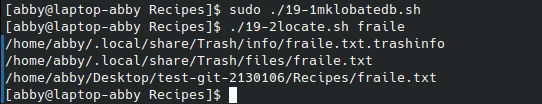

# codigo 19
## como funciona
son dos scripts. uno que crea un documento .db con la direccion de la mayoria de mis documentos
y el segundo script permite buscar dentro de ese .db

## notas
se tiene que ejecutar como sudo

### [codigo 19-1](Recipes/19-1mklobatedb.sh)

```bash
#!/bin/bash
  
locatedb="/tmp/locate.db"

if [ "$(whoami)" != "root" ] ; then
  echo "Must be root to run this command." >&2
  exit 1
fi

find / -print > $locatedb

exit 0
```

### [codigo 19-2](Recipes/19-2locate.sh)

```bash
#!/bin/sh

locatedb="/tmp/locate.db"

exec grep -i "$@" $locatedb
```
### salida 


[regresar](README.md)