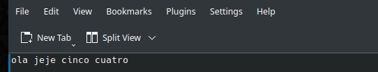
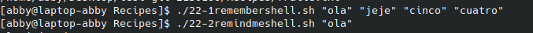

# codigo 22
## como funciona
son dos scripts. uno crea una lista de recordatorios y el segundo te permite buscar en esta

## notas
esta formado por dos scripts

### [codigo 22-1](Recipes/22-1remembershell.sh)

```bash
#!/bin/bash

rememberfile="$HOME/.remember"

if [ $# -eq 0 ] ; then
  echo "Enter note, end with ^D: "
  cat - >> $rememberfile
else
  echo "$@" >> $rememberfile
fi

exit 0
```

### [codigo 22-2](Recipes/22-2remindmeshell.sh)

```bash
#!/bin/bash

rememberfile="$HOME/.remember"

if [ ! -f $rememberfile ] ; then
  echo "$0: You don't seem to have a .remember file." >&2
  echo "To remedy this, please use 'remember' to add reminders" >&2
  exit 1
fi

if [ $# -eq 0 ] ; then
  more $rememberfile
else
  grep -i -- "$@" $rememberfile | ${PAGER:-more}
fi

exit 0
```
### salida 



[regresar](README.md)