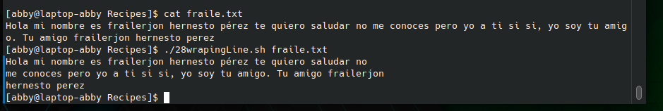

# codigo 28
## como funciona
convierte texto largo en muchas lineas de 72 caracteres de longitud

## notas
necesitas un documento con texto

### [codigo 28](Recipes/28wrapingLine.sh)

```bash
#!/bin/bash

width=72

if [ ! -r "$1" ] ; then
  echo "Cannot read file $1" >&2
  echo "Usage: $0 filename" >&2; exit 1
fi

while read input
do
   if [ ${#input} -gt $width ] ; then
     echo "$input" | fmt 
   else
     echo "$input"
   fi
done < $1

exit 0
```
### salidaa 


[reesar](README.md)