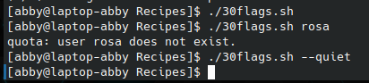

# codigo 30
## como funciona
ejecuta el comando quota con modificadores nuevos

## notas
necesita instalar el paquete quota-tools

### [codigo 30](Recipes/30flags.sh)

```bash
#!/bin/bash

flags=""
realquota="$(which quota)"

while [ $# -gt 0 ]
do
  case $1
  in
    --help)  echo "Usage: $0 [--group --verbose --quiet -gvq]" >&2
                       exit 1 ;;
    --group )  flags="$flags -g";       shift ;;
    --verbose)  flags="$flags -v";   shift ;;
    --quiet)  flags="$flags -q";       shift ;;
    --)  shift;           break ;;
    *)  break;
  esac
done

exec $realquota $flags "$@"
```
### salidaa 


[reesar](README.md)