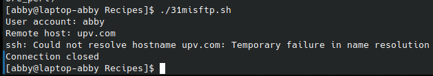

# codigo 31
## como funciona
ejecuta el comando sftp de forma mas intuitiva

## notas
necesitas intalar el comando sftp

### [codigo 31](Recipes/31misftp.sh)

```bash
#!/bin/bash

/bin/echo -n "User account: "
read account

if [ -z $account ] ; then
  exit 0;
fi

if [ -z "$1" ] ; then
  /bin/echo -n "Remote host: "
  read host
  if [ -z $host ] ; then
    exit 0
  fi
else
  host=$1
fi

exec sftp -C $account@$host
```
### salida 


[reesar](README.md)