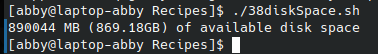

# codigo 38
## como funciona
muestra la capacidad del disco duro

## notas
funciona

### [codigo 38](Recipes/38diskSpace.sh)

```bash
#!/bin/bash

tempfile="/tmp/available.$$"

trap "rm -f $tempfile" EXIT

cat << 'EOF' > $tempfile
    { sum += $4 }
END { mb = sum / 1024
      gb = mb / 1024
      printf "%.0f MB (%.2fGB) of available disk space\n", mb, gb
    }
EOF

df -k | awk -f $tempfile

exit 0
```
### salida 


[regresar](README.md)