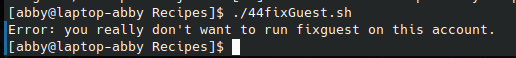

# codigo 44
## como funciona
limpia detras de un usuario de paso

## notas
necesita un usuario de paso

### [codigo 44](Recipes/44fixGuest.sh)

```bash
#!/bin/bash


iam=$(id -un)
myhome="$(grep "^${iam}:" /etc/passwd | cut -d: -f6)"

if [ "$iam" != "guest" ] ; then
  echo "Error: you really don't want to run fixguest on this account." >&2
  exit 1
fi

if [ ! -d $myhome/..template ] ; then
  echo "$0: no template directory found for rebuilding." >&2
  exit 1
fi

cd $myhome

rm -rf * $(find . -name ".[a-zA-Z0-9]*" -print)

cp -Rp ..template/* .
exit 0
```
### salida 


[reesar](README.md)