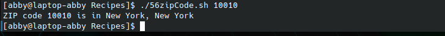

# codigo 56
## como funciona
Muestra la ubicacion de un codigo postal de EUA

## notas
necesita internet

### [codigo 56](Recipes/56zipCode.sh)

```bash
#!/bin/bash

baseURL="http://www.city-data.com/zips"

/bin/echo -n "ZIP code $1 is in "

curl -s -dump "$baseURL/$1.html" | \
   grep -i '<title>' | \
   cut -d\( -f2 | cut -d\) -f1

exit 0
```
### salida 


[reesar](README.md)