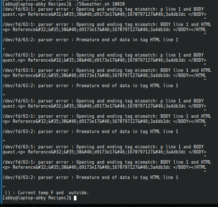

# codigo 58
## como funciona
muestra el clima dado un codigo postal

## notas
necesita una llave de wunderground la cual consgui pero no conecta correctamente con la pagina

### [codigo 58](Recipes/58weather.sh)

```bash
#!/bin/bash

if [ $# -ne 1 ]; then
  echo "Usage: $0 <zipcode>"
  exit 1
fi

apikey="603ce552cd7a4495bce552cd7a84952c"

weather=`curl -s \
    "https://api.wunderground.com/api/$apikey/conditions/q/$1.xml"`
state=`xmllint --xpath \
     //response/current_observation/display_location/full/text\(\) \
     <(echo $weather)`
zip=`xmllint --xpath \
     //response/current_observation/display_location/zip/text\(\) \
     <(echo $weather)`
current=`xmllint --xpath \
     //response/current_observation/temp_f/text\(\) \
     <(echo $weather)`
condition=`xmllint --xpath \
     //response/current_observation/weather/text\(\) \
     <(echo $weather)`

echo $state" ("$zip") : Current temp "$current"F and "$condition" outside." 
```
### salida 


[reesar](README.md)