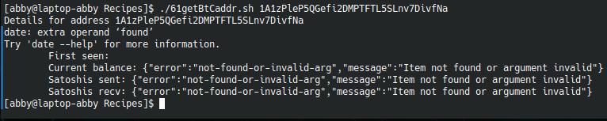

# codigo 61
## como funciona
muestra detalles de una cartera de bitcoin

## notas
la pagina blockchain.info no funciona entonces los comandos se ejecutan pero no reciben informacion

### [codigo 61](Recipes/61getBtCaddr.sh)

```bash
#!/bin/bash

if [ $# -ne 1 ]; then
  echo "Usage: $0 <address>"
  exit 1
fi

base_url="https://blockchain.info/q/"

balance=$(curl -s $base_url"addressbalance/"$1)
recv=$(curl -s $base_url"getreceivedbyaddress/"$1)
sent=$(curl -s $base_url"getsentbyaddress/"$1)
first_made=$(curl -s $base_url"addressfirstseen/"$1)

echo "Details for address $1"
echo -e "\tFirst seen: "$(date -d @$first_made)
echo -e "\tCurrent balance: "$balance
echo -e "\tSatoshis sent: "$sent
echo -e "\tSatoshis recv: "$recv
```
### salida 


[reesar](README.md)