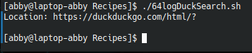

# codigo 64
## como funciona
genera un log de busquedas

## notas
necesita internet

### [codigo 66](Recipes/64logDuckSearch.sh)

```bash
#!/bin/bash

logfile="./searchlog.txt"

if [ ! -f $logfile ] ; then
  touch $logfile
  chmod a+rw $logfile
fi

if [ -w $logfile ] ; then
  echo "$(date): $QUERY_STRING" | sed 's/q=//g;s/+/ /g' >> $logfile
fi

echo "Location: https://duckduckgo.com/html/?$QUERY_STRING"
echo ""

exit 0
```
### salida


[reesar](README.md)