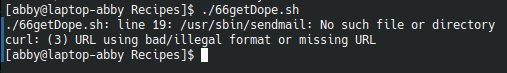

# codigo 66
## como funciona
convierte una pagina en correo electronico

## notas
necesita internet

### [codigo 66](Recipes/66getDope.sh)

```bash
#!/bin/bash
now="$(date +%y%m%d)"
start="https://www.straightdope.com/ "
to="2130171@upv.edu.mx"   

URL="$(curl -s "$start" | \
grep -A1 'teaser' | sed -n '2p' | \
cut -d\" -f2 | cut -d\" -f1)"

( cat << EOF
Subject: The Straight Dope for $(date "+%A, %d %B, %Y")
From: Cecil Adams <dont@reply.com>
Content-type: text/html
To: $to

EOF

curl "$URL"
) | /usr/sbin/sendmail -t

exit 0
```
### salidaa 


[reesar](README.md)