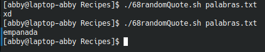

# codigo 68
## como funciona
selecciona una frase al azar de un txt

## notas
necesita un txt con palabras

### [codigo 68](Recipes/68randomQuote.sh)

```bash
#!/bin/bash

awkscript="/tmp/randomquote.awk.$$"

if [ $# -ne 1 ] ; then
  echo "Usage: randomquote datafilename" >&2
  exit 1
elif [ ! -r "$1" ] ; then
  echo "Error: quote file $1 is missing or not readable" >&2
  exit 1
fi

trap "$(which rm) -f $awkscript" 0

cat << "EOF" > $awkscript
BEGIN { srand() }
      { s[NR] = $0 } 
END   { print s[randint(NR)] } 
function randint(n) { return int (n * rand() ) + 1 }
EOF

awk -f $awkscript < "$1"

exit 0
```
### salida


[regresar](README.md)