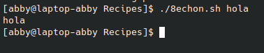

# codigo 8
## como funciona
realiza la funcion de un "echo -n"

## notas
no tiene requerimientos

### [codigo 8](Recipes/8echon.sh)

```bash
#!/bin/bash
echon(){
    echo "$*" | tr -d '%'
}

echon $*
```

### salida 


[reesar](README.md)