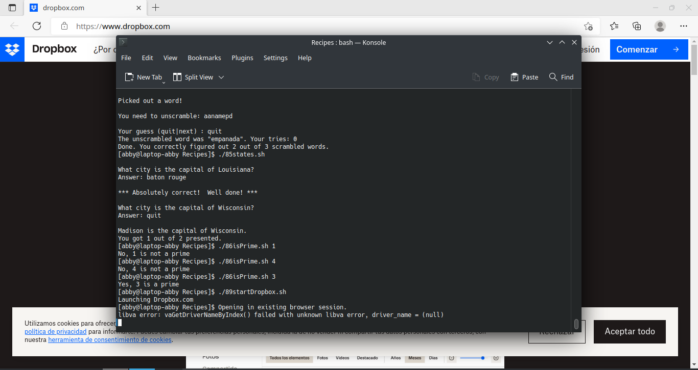

# codigo 89
## como funciona
abre dropbox.com

## notas
necesita internet

### [codigo 89](Recipes/89startDropbox.sh)

```bash
#!/bin/bash

app="Dropbox.com"
verbose=1

running="$(ps aux | grep -i $app | grep -v grep)"

if [ "$1" = "-s" ] ; then	
  verbose=0
fi

if [ ! -z "$running" ] ; then
  if [ $verbose -eq 1 ] ; then
    echo "$app is running with PID $(echo $running | cut -d\  -f2)"
  fi
else
  if [ $verbose -eq 1 ] ; then
    echo "Launching $app"
  fi
  xdg-open $app
fi

exit 0
```
### salida


[regresar](README.md)