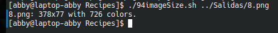

# codigo 94
## como funciona
imprime caracteristicas de una imagen

## notas
necesita una imagen

### [codigo 94](Recipes/94imageSize.sh)

```bash
#!/bin/bash

for name
do
  identify -format "%f: %G with %k colors.\n" "$name"
done
exit 0
```
### salida


[regresar](README.md)