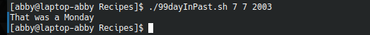

# codigo 99
## como funciona
indica el dia que era en el pasado

## notas
necesita ncal

### [codigo 99](Recipes/99dayInPast.sh)

```bash
#!/bin/bash

if [ $# -ne 3 ] ; then
  echo "Usage: $(basename $0) mon day year" >&2
  echo "  with just numerical values (ex: 7 7 1776)" >&2
  exit 1
fi

date --version > /dev/null 2>&1 	
baddate="$?"			

if [ ! $baddate ] ; then
  date -d $1/$2/$3 +"That was a %A."
else

  if [ $2 -lt 10 ] ; then
    pattern=" $2[^0-9]"
  else
    pattern="$2[^0-9]"
  fi

  dayofweek="$(ncal $1 $3 | grep "$pattern" | cut -c1-2)"

  case $dayofweek in 
    Su ) echo "That was a Sunday"; 	;;
    Mo ) echo "That was a Monday"; 	;;
    Tu ) echo "That was a Tuesday"; 	;;
    We ) echo "That was a Wednesday"; 	;;
    Th ) echo "That was a Thursday"; 	;;
    Fi ) echo "That was a Friday"; 	;;
    Sa ) echo "That was a Saturday"; 	;;
  esac
fi
exit 0
```
### salida


[regresar](README.md)